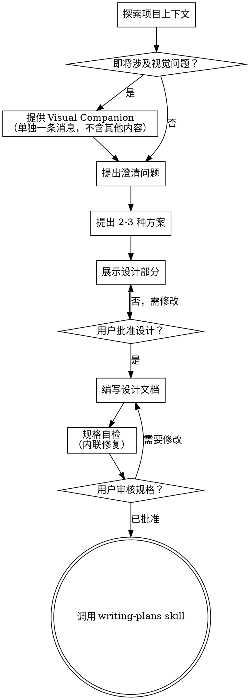

# 把想法打磨成设计

通过自然的协作式对话，把想法逐步收敛成完整的设计和规格说明。

先理解当前项目上下文，然后一次只问一个问题来细化想法。当你真正明白要构建什么之后，再展示设计并获得用户批准。

<HARD-GATE>
在你展示设计并获得用户批准之前，不要调用任何实现类 skill，不要写代码，不要搭脚手架，也不要采取任何实现动作。无论项目看起来多简单，这条都适用。
</HARD-GATE>

## 反模式："这太简单了，不需要设计"

每个项目都必须经过这个流程。待办清单、单个工具函数、配置修改，全都一样。越是"简单"的项目，越容易因为未经检验的假设而浪费时间。设计可以很短（真正简单的项目用几句话也行），但你**必须**先展示设计并获得批准。

## 清单

你必须为下面每一项创建任务，并按顺序完成：

1. **探索项目上下文** — 查看文件、文档和最近提交
2. **提供视觉 companion**（如果主题会涉及视觉问题）— 这是一项必须单独发一条消息的内容，不能和澄清问题放在一起。见下文"Visual Companion"部分。
3. **提出澄清问题** — 一次一个，理解目标、约束和成功标准
4. **提出 2-3 种方案** — 给出权衡，并说明你的推荐
5. **展示设计** — 按复杂度拆成多个部分，每一部分都在继续前取得用户确认
6. **编写设计文档** — 保存到 `docs/superpowers/specs/YYYY-MM-DD-<topic>-design.md` 并提交
7. **规格自检** — 快速内联检查占位符、矛盾、歧义和范围（见下文）
8. **用户审核规格文档** — 在继续之前请用户审核规格文件
9. **转入实现阶段** — 调用 `writing-plans` skill 来生成实现计划

## 流程图

**终止状态是调用 `writing-plans`。** 不要调用 `frontend-design`、`mcp-builder` 或任何其他实现类 skill。brainstorming 之后你调用的唯一 skill 就是 `writing-plans`。

## 流程

**理解想法：**

- 先查看当前项目状态（文件、文档、最近提交）
- 在提出详细问题之前，先评估范围：如果请求描述了多个独立的子系统（例如"构建一个包含聊天、文件存储、计费和分析的平台"），立即指出。不要把时间花在为需要先拆分的项目细化细节上。
- 如果项目太大，无法用一个规格说明覆盖，帮助用户拆分成子项目：哪些是独立的部分，它们之间如何关联，应该按什么顺序构建？然后通过正常的设计流程来头脑风暴第一个子项目。每个子项目都有自己独立的规格→计划→实现周期。
- 对于范围合适的项目，一次只问一个问题来细化想法
- 尽可能使用多选题，开放式问题也可以
- 每条消息只问一个问题 — 如果某个话题需要进一步探索，拆分成多个问题
- 聚焦于理解：目的、约束、成功标准

**探索方案：**

- 提出 2-3 种不同方案及其权衡
- 用对话的方式呈现方案，给出你的推荐和理由
- 以你推荐的方案开头，并解释原因

**展示设计：**

- 当你认为自己已经理解了要构建什么之后，展示设计
- 根据复杂度调整每个部分的篇幅：简单的几句话，复杂的最多 200-300 字
- 每个部分展示完后询问目前是否正确
- 涵盖：架构、组件、数据流、错误处理、测试
- 如果有不清楚的地方，随时回去澄清

**为隔离和清晰而设计：**

- 把系统拆分成更小的单元，每个单元都有单一明确的职责，通过定义良好的接口通信，可以独立理解和测试
- 对于每个单元，你应该能回答：它做什么，怎么用，它依赖什么？
- 别人能不读内部实现就理解一个单元的功能吗？你能改内部实现而不破坏调用方吗？如果不能，边界需要调整。
- 更小、边界清晰的单元也更容易让你工作 — 你能更好地推理可以一次性放入上下文的代码，当文件职责聚焦时你的编辑也更可靠。当一个文件变得很大时，这通常说明它承担了太多职责。

**在已有代码库中工作：**

- 在提出修改之前先探索现有结构。遵循已有的模式。
- 当现有代码中存在影响当前工作的问题（例如文件过大、边界不清晰、职责纠缠），在设计中纳入有针对性的改进 — 就像一个优秀的开发者会改进他们正在工作的代码一样。
- 不要提出无关的重构。专注于服务于当前目标的内容。

## 设计之后

**文档：**

- 将验证过的设计（规格说明）写入 `docs/superpowers/specs/YYYY-MM-DD-<topic>-design.md`
  - （用户对规格文件位置的偏好会覆盖此默认值）
- 如果 `elements-of-style:writing-clearly-and-concisely` skill 可用则使用
- 将设计文档提交到 git

**规格自检：**
写完规格文档后，用新鲜的眼光重新审视：

1. **占位符扫描：** 是否有"TBD"、"TODO"、不完整的章节或模糊的需求？修复它们。
2. **内部一致性：** 各章节之间是否存在矛盾？架构是否与功能描述一致？
3. **范围检查：** 是否足够聚焦，可以用一个实现计划覆盖，还是需要拆分？
4. **歧义检查：** 是否有需求可以被理解为两种不同的意思？如果有，选定一种并明确写出。

直接内联修复问题。不需要重新审核 — 修完就继续。

**用户审核关卡：**
规格自检通过后，请用户在继续之前审核写好的规格文档：

> "规格文档已写入并提交到 `<path>`。请审核一下，在我们开始编写实现计划之前，告诉我是否需要做任何修改。"

等待用户的回复。如果他们要求修改，执行修改并重新运行规格自检。只有在用户批准后才继续。

**实现：**

- 调用 `writing-plans` skill 来创建详细的实现计划
- 不要调用任何其他 skill。下一步就是 `writing-plans`。

## 核心原则

- **一次只问一个问题** — 不要用多个问题淹没用户
- **优先使用多选题** — 在可能的情况下比开放式问题更容易回答
- **严格执行 YAGNI** — 从所有设计中移除不必要的功能
- **探索替代方案** — 在确定方案之前始终提出 2-3 种方案
- **增量验证** — 展示设计，在继续之前获得批准
- **保持灵活** — 当有不清楚的地方随时回去澄清

## Visual Companion

一个基于浏览器的伴侣工具，用于在头脑风暴过程中展示模型、图表和视觉选项。以工具形式提供 — 不是一种模式。接受 companion 意味着在受益于视觉呈现的问题中可以使用它；不代表每个问题都要通过浏览器展示。

**提供 companion：** 当你预期接下来的问题会涉及视觉内容（模型、布局、图表）时，一次性提供并征求同意：
> "我们接下来要讨论的内容，如果能用浏览器展示给你看可能会更容易理解。我可以在过程中制作模型、图表、对比和其他视觉内容。这个功能还比较新，可能会消耗较多 token。要试试吗？（需要打开一个本地 URL）"

**这个提议必须是单独的一条消息。** 不要把它和澄清问题、上下文总结或任何其他内容放在一起。这条消息应该只包含上面的提议，不含其他内容。等待用户回复后再继续。如果他们拒绝，继续纯文本的头脑风暴。

**逐问题决策：** 即使在用户接受后，对每个问题也要决定是使用浏览器还是终端。判断标准：**用户通过看到视觉内容会比通过阅读文字更好地理解吗？**

- **使用浏览器** 展示本质上是视觉的内容 — 模型、线框图、布局对比、架构图、并排的视觉设计
- **使用终端** 展示文本内容 — 需求问题、概念选择、权衡列表、A/B/C/D 文本选项、范围决策

一个关于 UI 的问题不自动就是视觉问题。"个性在这个上下文中是什么意思？"是一个概念性问题 — 用终端。"哪种向导布局更好？"是一个视觉问题 — 用浏览器。

如果他们同意使用 companion，在继续之前先阅读详细指南：
`skills/brainstorming/visual-companion.md`
