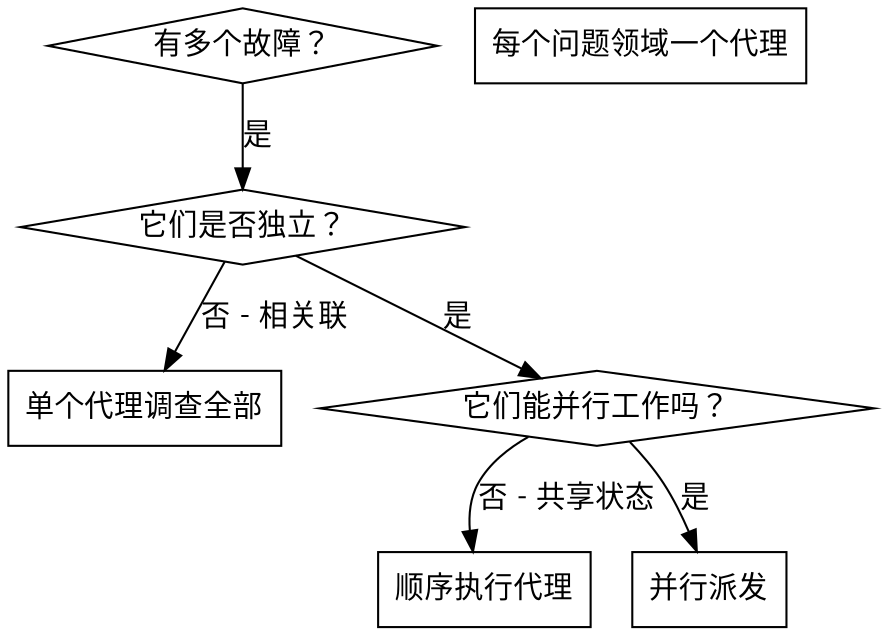

# 派发并行代理

## 概述

你将任务委派给具有隔离上下文的专业代理。通过精确构建它们的指令和上下文，你确保它们保持专注并成功完成任务。它们绝不应继承你会话的上下文或历史——你只需构建它们所需的内容。这也为你自己的协调工作保留了上下文空间。

当你遇到多个不相关的故障（不同的测试文件、不同的子系统、不同的 bug）时，按顺序逐一排查会浪费时间。每项调查都是独立的，可以并行进行。

**核心原则：** 每个独立的问题领域派发一个代理。让它们并发工作。

## 何时使用



**适用场景：**
- 3 个以上测试文件因不同根因而失败
- 多个子系统独立故障
- 每个问题可以独立理解，不需要其他问题的上下文
- 各项调查之间没有共享状态

**不适用场景：**
- 故障之间存在关联（修复一个可能连带修复其他）
- 需要了解完整的系统状态
- 代理之间会互相干扰

## 模式

### 1. 识别独立的问题领域

按故障类别分组：
- 文件 A 测试：工具审批流程
- 文件 B 测试：批量完成行为
- 文件 C 测试：中止功能

每个领域是独立的——修复工具审批不会影响中止测试。

### 2. 创建聚焦的代理任务

每个代理获得：
- **明确的范围：** 一个测试文件或子系统
- **清晰的目标：** 让这些测试通过
- **约束条件：** 不要修改其他代码
- **预期输出：** 你发现和修复内容的摘要

### 3. 并行派发

```typescript
// In Claude Code / AI environment
Task("Fix agent-tool-abort.test.ts failures")
Task("Fix batch-completion-behavior.test.ts failures")
Task("Fix tool-approval-race-conditions.test.ts failures")
// All three run concurrently
```

### 4. 审查与整合

代理返回后：
- 阅读每个摘要
- 验证修复不冲突
- 运行完整测试套件
- 整合所有变更

## 代理提示结构

好的代理提示应当：
1. **聚焦** - 一个清晰的问题领域
2. **自包含** - 理解问题所需的全部上下文
3. **输出明确** - 代理应该返回什么？

```markdown
Fix the 3 failing tests in src/agents/agent-tool-abort.test.ts:

1. "should abort tool with partial output capture" - expects 'interrupted at' in message
2. "should handle mixed completed and aborted tools" - fast tool aborted instead of completed
3. "should properly track pendingToolCount" - expects 3 results but gets 0

These are timing/race condition issues. Your task:

1. Read the test file and understand what each test verifies
2. Identify root cause - timing issues or actual bugs?
3. Fix by:
   - Replacing arbitrary timeouts with event-based waiting
   - Fixing bugs in abort implementation if found
   - Adjusting test expectations if testing changed behavior

Do NOT just increase timeouts - find the real issue.

Return: Summary of what you found and what you fixed.
```

## 常见错误

**❌ 太宽泛：** "Fix all the tests" - 代理会迷失方向
**✅ 具体明确：** "Fix agent-tool-abort.test.ts" - 聚焦的范围

**❌ 没有上下文：** "Fix the race condition" - 代理不知道在哪里
**✅ 提供上下文：** 粘贴错误信息和测试名称

**❌ 没有约束：** 代理可能会重构一切
**✅ 设置约束：** "Do NOT change production code" 或 "Fix tests only"

**❌ 输出模糊：** "Fix it" - 你不知道改了什么
**✅ 明确输出：** "Return summary of root cause and changes"

## 何时不使用

**关联故障：** 修复一个可能连带修复其他——先一起调查
**需要完整上下文：** 理解问题需要查看整个系统
**探索性调试：** 你还不知道什么坏了
**共享状态：** 代理会互相干扰（编辑相同文件、使用相同资源）

## 会话中的真实示例

**场景：** 大规模重构后，3 个文件中有 6 个测试失败

**失败项：**
- agent-tool-abort.test.ts：3 个失败（时序问题）
- batch-completion-behavior.test.ts：2 个失败（工具未执行）
- tool-approval-race-conditions.test.ts：1 个失败（执行计数 = 0）

**判断：** 独立领域——中止逻辑、批量完成、竞态条件各自独立

**派发：**
```
Agent 1 → Fix agent-tool-abort.test.ts
Agent 2 → Fix batch-completion-behavior.test.ts
Agent 3 → Fix tool-approval-race-conditions.test.ts
```

**结果：**
- Agent 1：用基于事件的等待替换了超时
- Agent 2：修复了事件结构 bug（threadId 放错了位置）
- Agent 3：添加了对异步工具执行完成的等待

**整合：** 所有修复相互独立，没有冲突，完整测试套件全部通过

**节省时间：** 3 个问题并行解决，而非顺序处理

## 核心优势

1. **并行化** - 多项调查同时进行
2. **聚焦** - 每个代理范围狭窄，需要跟踪的上下文更少
3. **独立性** - 代理之间不会互相干扰
4. **速度** - 3 个问题在 1 个问题的时间内解决

## 验证

代理返回后：
1. **审查每个摘要** - 了解变更了什么
2. **检查冲突** - 代理是否编辑了相同代码？
3. **运行完整套件** - 验证所有修复协同工作
4. **抽检** - 代理可能犯系统性错误

## 实际影响

来自调试会话（2025-10-03）：
- 3 个文件中有 6 个失败
- 并行派发了 3 个代理
- 所有调查并发完成
- 所有修复成功整合
- 代理变更之间零冲突
