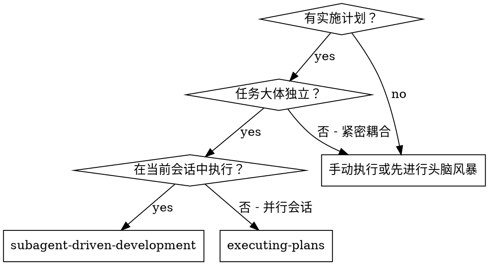
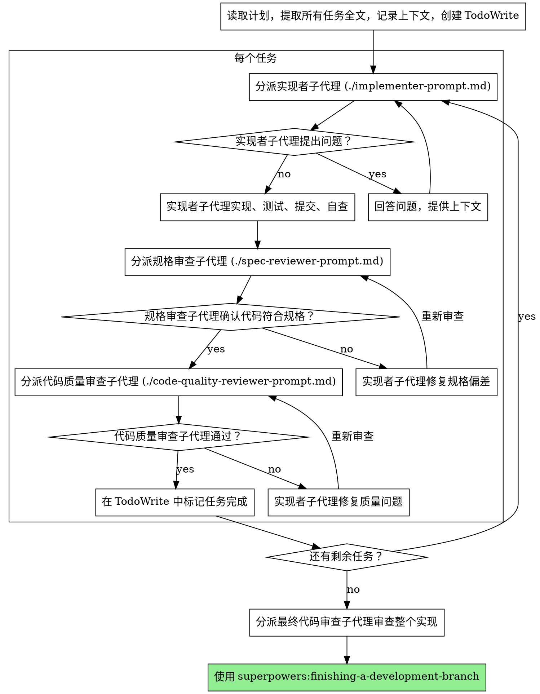

# 子代理驱动开发

通过为每个任务分派新的子代理来执行计划，每个任务完成后进行两阶段审查：先检查规格合规性，再审查代码质量。

**为什么用子代理：** 你将任务委托给具有隔离上下文的专业代理。通过精确构建它们的指令和上下文，确保它们保持专注并成功完成任务。它们不应继承你会话的上下文或历史——你只需构建它们所需的内容。这也为你自己的协调工作保留了上下文空间。

**核心原则：** 每个任务一个新子代理 + 两阶段审查（先规格后质量）= 高质量、快速迭代

## 何时使用



**与执行计划（并行会话）的对比：**
- 同一会话（无上下文切换）
- 每个任务一个新子代理（无上下文污染）
- 每个任务完成后两阶段审查：先规格合规性，再代码质量
- 更快迭代（任务之间无需人工介入）

## 流程



## 模型选择

使用能胜任每个角色的最低能力模型，以节省成本并提高速度。

**机械性实现任务**（独立函数、明确规格、1-2 个文件）：使用快速、廉价的模型。当计划明确时，大多数实现任务都是机械性的。

**集成与判断任务**（多文件协调、模式匹配、调试）：使用标准模型。

**架构、设计和审查任务**：使用最强大的可用模型。

**任务复杂度信号：**
- 涉及 1-2 个文件且有完整规格 → 廉价模型
- 涉及多个文件且有集成问题 → 标准模型
- 需要设计判断或广泛的代码库理解 → 最强大的模型

## 处理实现者状态

实现者子代理会报告以下四种状态之一，请分别妥善处理：

**DONE：** 进入规格合规性审查。

**DONE_WITH_CONCERNS：** 实现者完成了工作但标记了疑虑。在继续之前阅读这些疑虑。如果疑虑涉及正确性或范围，在审查前先解决它们。如果是观察性备注（如"这个文件越来越大"），记录下来然后进入审查。

**NEEDS_CONTEXT：** 实现者需要未提供的信息。提供缺失的上下文并重新分派。

**BLOCKED：** 实现者无法完成任务。评估阻塞原因：
1. 如果是上下文问题，提供更多上下文并用相同模型重新分派
2. 如果任务需要更强的推理能力，用更强大的模型重新分派
3. 如果任务太大，将其拆分为更小的部分
4. 如果计划本身有误，上报给人类

**绝不**忽略上报，也**绝不**在不做任何改变的情况下强制同一模型重试。如果实现者说它卡住了，那一定有什么需要改变。

## 提示模板

- `./implementer-prompt.md` - 分派实现者子代理
- `./spec-reviewer-prompt.md` - 分派规格合规性审查子代理
- `./code-quality-reviewer-prompt.md` - 分派代码质量审查子代理

## 示例工作流

```
You: 我正在使用子代理驱动开发来执行这个计划。

[读取计划文件一次: docs/superpowers/plans/feature-plan.md]
[提取全部 5 个任务的全文和上下文]
[创建包含所有任务的 TodoWrite]

任务 1: Hook 安装脚本

[获取任务 1 的文本和上下文（已提取）]
[分派实现子代理，附带完整任务文本 + 上下文]

Implementer: "开始之前 - hook 应该安装在用户级还是系统级？"

You: "用户级 (~/.config/superpowers/hooks/)"

Implementer: "明白。开始实现..."
[稍后] Implementer:
  - 实现了 install-hook 命令
  - 添加了测试，5/5 通过
  - 自查：发现遗漏了 --force 标志，已添加
  - 已提交

[分派规格合规性审查]
Spec reviewer: ✅ 规格合规 - 所有需求已满足，无多余内容

[获取 git SHA，分派代码质量审查]
Code reviewer: 优点：测试覆盖良好，代码整洁。问题：无。已通过。

[标记任务 1 完成]

任务 2: 恢复模式

[获取任务 2 的文本和上下文（已提取）]
[分派实现子代理，附带完整任务文本 + 上下文]

Implementer: [无疑问，直接开始]
Implementer:
  - 添加了 verify/repair 模式
  - 8/8 测试通过
  - 自查：一切正常
  - 已提交

[分派规格合规性审查]
Spec reviewer: ❌ 问题：
  - 缺失：进度报告（规格要求"每 100 项报告一次"）
  - 多余：添加了 --json 标志（未要求）

[实现者修复问题]
Implementer: 移除了 --json 标志，添加了进度报告

[规格审查者再次审查]
Spec reviewer: ✅ 现在规格合规

[分派代码质量审查]
Code reviewer: 优点：扎实。问题（重要）：魔法数字 (100)

[实现者修复]
Implementer: 提取了 PROGRESS_INTERVAL 常量

[代码审查者再次审查]
Code reviewer: ✅ 已通过

[标记任务 2 完成]

...

[所有任务完成后]
[分派最终代码审查]
Final reviewer: 所有需求已满足，可以合并

Done!
```

## 优势

**与手动执行的对比：**
- 子代理自然遵循 TDD
- 每个任务都是全新上下文（无混淆）
- 并行安全（子代理互不干扰）
- 子代理可以提问（工作前和工作期间都可以）

**与执行计划的对比：**
- 同一会话（无交接）
- 持续推进（无需等待）
- 自动审查检查点

**效率提升：**
- 无文件读取开销（控制器提供全文）
- 控制器精确策划所需上下文
- 子代理预先获得完整信息
- 在工作开始前暴露问题（而非之后）

**质量关卡：**
- 自查在交接前发现问题
- 两阶段审查：规格合规性，然后代码质量
- 审查循环确保修复确实有效
- 规格合规性防止过度构建或构建不足
- 代码质量确保实现质量过硬

**成本：**
- 更多子代理调用（每个任务 = 实现者 + 2 个审查者）
- 控制器做更多准备工作（预先提取所有任务）
- 审查循环增加迭代次数
- 但能早期发现问题（比后期调试更便宜）

## Red Flag

**绝不：**
- 在未经用户明确同意的情况下在 main/master 分支上开始实现
- 跳过任何审查（规格合规性或代码质量）
- 在有未修复问题的情况下继续推进
- 并行分派多个实现子代理（会产生冲突）
- 让子代理读取计划文件（应直接提供全文）
- 跳过背景上下文（子代理需要理解任务的定位）
- 忽略子代理的问题（在让它们继续之前必须回答）
- 对规格合规性接受"差不多就行"（规格审查者发现了问题 = 未完成）
- 跳过审查循环（审查者发现问题 = 实现者修复 = 再次审查）
- 用实现者自查替代正式审查（两者都需要）
- **在规格合规性 ✅ 之前开始代码质量审查**（顺序错误）
- 在任一审查有未解决问题的情况下进入下一个任务

**如果子代理提出问题：**
- 清晰、完整地回答
- 如需要则提供额外上下文
- 不要催促它们进入实现阶段

**如果审查者发现问题：**
- 实现者（同一子代理）修复问题
- 审查者再次审查
- 重复直到通过
- 不要跳过再次审查

**如果子代理无法完成任务：**
- 分派修复子代理并附带具体指令
- 不要尝试手动修复（会造成上下文污染）

## 集成

**必需的工作流技能：**
- **superpowers:using-git-worktrees** - 必需：开始前设置隔离工作区
- **superpowers:writing-plans** - 创建本技能执行的计划
- **superpowers:requesting-code-review** - 审查子代理的代码审查模板
- **superpowers:finishing-a-development-branch** - 所有任务完成后收尾开发

**子代理应使用：**
- **superpowers:test-driven-development** - 子代理对每个任务遵循 TDD

**替代工作流：**
- **superpowers:executing-plans** - 用于并行会话而非同会话执行
