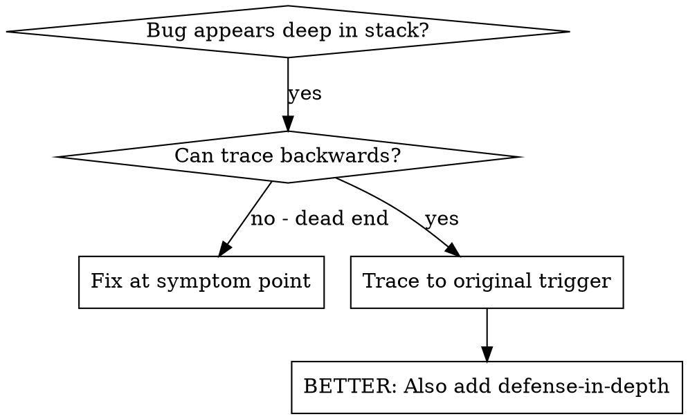
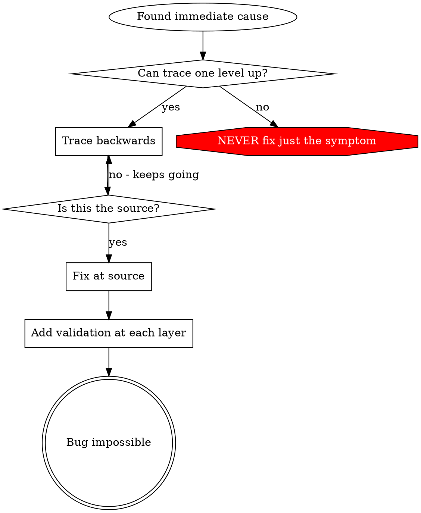

# 根因追溯

## 概述

Bug 通常在调用栈深处显现（在错误目录执行 git init、文件创建到错误位置、用错误路径打开数据库）。你的直觉是修复报错的位置，但那只是在治标。

**核心原则：** 沿调用链逆向追溯，直到找到原始触发点，然后在源头修复。

## 适用场景



**适用于：**
- 错误发生在执行深处（而非入口点）
- Stack trace 显示较长的调用链
- 不清楚无效数据从何而来
- 需要找到是哪个测试/代码触发了问题

## 追溯过程

### 1. 观察症状
```
Error: git init failed in /Users/jesse/project/packages/core
```

### 2. 找到直接原因
**是哪段代码直接导致了这个问题？**
```typescript
await execFileAsync('git', ['init'], { cwd: projectDir });
```

### 3. 追问：谁调用了这里？
```typescript
WorktreeManager.createSessionWorktree(projectDir, sessionId)
  → called by Session.initializeWorkspace()
  → called by Session.create()
  → called by test at Project.create()
```

### 4. 继续向上追溯
**传入了什么值？**
- `projectDir = ''`（空字符串！）
- 空字符串作为 `cwd` 会解析为 `process.cwd()`
- 那就是源代码目录！

### 5. 找到原始触发点
**空字符串从哪来的？**
```typescript
const context = setupCoreTest(); // Returns { tempDir: '' }
Project.create('name', context.tempDir); // Accessed before beforeEach!
```

## 添加 Stack Trace

当无法手动追溯时，添加埋点：

```typescript
// Before the problematic operation
async function gitInit(directory: string) {
  const stack = new Error().stack;
  console.error('DEBUG git init:', {
    directory,
    cwd: process.cwd(),
    nodeEnv: process.env.NODE_ENV,
    stack,
  });

  await execFileAsync('git', ['init'], { cwd: directory });
}
```

**关键：** 测试中用 `console.error()`（不要用 logger——可能不会显示）

**运行并捕获输出：**
```bash
npm test 2>&1 | grep 'DEBUG git init'
```

**分析 stack trace：**
- 寻找测试文件名
- 找到触发调用的行号
- 识别模式（同一个测试？同一个参数？）

## 定位造成污染的测试

如果在测试过程中出现了某个问题，但不知道是哪个测试引起的：

使用本目录下的二分查找脚本 `find-polluter.sh`：

```bash
./find-polluter.sh '.git' 'src/**/*.test.ts'
```

逐个运行测试，在第一个污染者处停止。具体用法见脚本。

## 真实案例：空的 projectDir

**症状：** `.git` 被创建在 `packages/core/`（源代码目录）

**追溯链：**
1. `git init` 在 `process.cwd()` 中运行 ← 空 cwd 参数
2. WorktreeManager 收到了空的 projectDir
3. Session.create() 传入了空字符串
4. 测试在 beforeEach 之前就访问了 `context.tempDir`
5. setupCoreTest() 初始返回 `{ tempDir: '' }`

**根因：** 顶层变量初始化时访问了尚未赋值的值

**修复：** 将 tempDir 改为 getter，在 beforeEach 之前访问会抛出异常

**同时添加了纵深防御：**
- 第 1 层：Project.create() 验证目录
- 第 2 层：WorkspaceManager 验证非空
- 第 3 层：NODE_ENV 守卫拒绝在 tmpdir 之外执行 git init
- 第 4 层：在 git init 之前记录 stack trace

## 核心原则



**绝不要只修复报错的位置。** 追溯到原始触发点再修复。

## Stack Trace 技巧

**在测试中：** 使用 `console.error()` 而非 logger——logger 可能被抑制
**在操作之前：** 在危险操作之前记录日志，而不是等它失败之后
**包含上下文：** 目录、cwd、环境变量、时间戳
**捕获 stack：** `new Error().stack` 展示完整的调用链

## 实际效果

来自调试会话（2025-10-03）：
- 通过 5 层追溯找到根因
- 在源头修复（getter 验证）
- 添加了 4 层防御
- 1847 个测试全部通过，零污染
