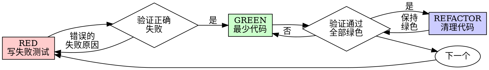

# 测试驱动开发（TDD）

## 概述

先写测试。看着它失败。写最少的代码让它通过。

**核心原则：** 如果你没有看到测试失败，你就不知道它是否测对了东西。

**违反规则的字面意思就是违反规则的精神。**

## 何时使用

**始终使用：**
- 新功能
- Bug 修复
- 重构
- 行为变更

**例外（询问你的人工伙伴）：**
- 一次性原型
- 生成代码
- 配置文件

想着"就这一次跳过 TDD"？停下。那是在自我合理化。

## 铁律

```
NO PRODUCTION CODE WITHOUT A FAILING TEST FIRST
```

先写了代码再写测试？删掉它。重新开始。

**没有例外：**
- 不要把它留作"参考"
- 不要在写测试时"调整"它
- 不要看它
- 删除就是删除

从测试出发，重新实现。就这么简单。

## Red-Green-Refactor



### RED - 写失败测试

写一个最小的测试来展示期望的行为。

<Good>
```typescript
test('retries failed operations 3 times', async () => {
  let attempts = 0;
  const operation = () => {
    attempts++;
    if (attempts < 3) throw new Error('fail');
    return 'success';
  };

  const result = await retryOperation(operation);

  expect(result).toBe('success');
  expect(attempts).toBe(3);
});
```
名称清晰，测试真实行为，只测一件事
</Good>

<Bad>
```typescript
test('retry works', async () => {
  const mock = jest.fn()
    .mockRejectedValueOnce(new Error())
    .mockRejectedValueOnce(new Error())
    .mockResolvedValueOnce('success');
  await retryOperation(mock);
  expect(mock).toHaveBeenCalledTimes(3);
});
```
名称模糊，测的是 mock 不是代码
</Bad>

**要求：**
- 一个行为
- 清晰的名称
- 真实代码（除非不可避免，否则不用 mock）

### 验证 RED - 看着它失败

**必须执行。绝不跳过。**

```bash
npm test path/to/test.test.ts
```

确认：
- 测试失败（不是报错）
- 失败信息符合预期
- 因为功能缺失而失败（不是拼写错误）

**测试通过了？** 你在测试已有行为。修正测试。

**测试报错了？** 修正错误，重新运行，直到它正确地失败。

### GREEN - 最少代码

写最简单的代码让测试通过。

<Good>
```typescript
async function retryOperation<T>(fn: () => Promise<T>): Promise<T> {
  for (let i = 0; i < 3; i++) {
    try {
      return await fn();
    } catch (e) {
      if (i === 2) throw e;
    }
  }
  throw new Error('unreachable');
}
```
刚好足够通过
</Good>

<Bad>
```typescript
async function retryOperation<T>(
  fn: () => Promise<T>,
  options?: {
    maxRetries?: number;
    backoff?: 'linear' | 'exponential';
    onRetry?: (attempt: number) => void;
  }
): Promise<T> {
  // YAGNI
}
```
过度设计
</Bad>

不要添加功能、重构其他代码，或超越测试范围去"改进"。

### 验证 GREEN - 看着它通过

**必须执行。**

```bash
npm test path/to/test.test.ts
```

确认：
- 测试通过
- 其他测试仍然通过
- 输出干净（无错误、无警告）

**测试失败了？** 修正代码，不是修正测试。

**其他测试失败了？** 立即修复。

### REFACTOR - 清理代码

只在绿色之后：
- 消除重复
- 改善命名
- 提取辅助函数

保持测试绿色。不要添加行为。

### 重复

为下一个功能写下一个失败测试。

## 好的测试

| 质量 | 好 | 坏 |
|------|---|---|
| **最小化** | 只测一件事。名称里有"和"？拆分它。 | `test('validates email and domain and whitespace')` |
| **清晰** | 名称描述行为 | `test('test1')` |
| **展示意图** | 展示期望的 API | 掩盖了代码应该做什么 |

## 为什么顺序很重要

**"我之后写测试来验证它工作"**

代码之后写的测试会立即通过。立即通过说明不了任何问题：
- 可能测错了东西
- 可能测的是实现，不是行为
- 可能遗漏了你忘记的边界情况
- 你从来没看到它捕获过 bug

测试先行迫使你看到测试失败，证明它确实在测试某些东西。

**"我已经手动测试了所有边界情况"**

手动测试是临时的。你以为测试了所有东西，但是：
- 没有测试了什么的记录
- 代码变更时无法重新运行
- 压力下容易遗漏情况
- "我试过的时候没问题" ≠ 全面覆盖

自动化测试是系统化的。它们每次都以相同方式运行。

**"删掉 X 小时的工作太浪费了"**

沉没成本谬误。时间已经花掉了。你现在的选择：
- 删掉并用 TDD 重写（再多 X 小时，高置信度）
- 保留并在之后补测试（30 分钟，低置信度，可能有 bug）

"浪费"是保留你无法信任的代码。没有真正测试的工作代码就是技术债。

**"TDD 太教条了，务实意味着灵活变通"**

TDD 就是务实的：
- 提交前发现 bug（比之后调试更快）
- 防止回归（测试立即捕获问题）
- 记录行为（测试展示如何使用代码）
- 支持重构（自由修改，测试捕获问题）

"务实"的捷径 = 在生产环境调试 = 更慢。

**"后补测试能实现同样目标——重要的是精神不是仪式"**

不。后补测试回答的是"这段代码做了什么？"先行测试回答的是"这段代码应该做什么？"

后补测试受你的实现偏差影响。你测试的是你构建的东西，而不是需求。你验证的是你记得的边界情况，而不是发现的边界情况。

先行测试迫使你在实现之前发现边界情况。后补测试验证的是你记住了所有东西（你并没有）。

30 分钟的后补测试 ≠ TDD。你得到了覆盖率，失去了测试有效的证明。

## 常见自我合理化

| 借口 | 现实 |
|------|------|
| "太简单了不用测试" | 简单的代码也会出 bug。测试只需 30 秒。 |
| "我之后补测试" | 测试立即通过说明不了任何问题。 |
| "后补测试能实现同样目标" | 后补测试 = "这段代码做了什么？"先行测试 = "这段代码应该做什么？" |
| "已经手动测试过了" | 临时的 ≠ 系统化的。没有记录，无法重新运行。 |
| "删掉 X 小时太浪费了" | 沉没成本谬误。保留未验证的代码才是技术债。 |
| "留作参考，先写测试" | 你会去"调整"它。那就是后补测试。删除就是删除。 |
| "需要先探索" | 可以。探索完就扔掉，用 TDD 重新开始。 |
| "测试很难写 = 设计不清晰" | 听测试的。难以测试 = 难以使用。 |
| "TDD 会拖慢我" | TDD 比调试更快。务实 = 测试先行。 |
| "手动测试更快" | 手动测试不能证明边界情况。每次变更都要重新测试。 |
| "现有代码没有测试" | 你在改进它。为现有代码添加测试。 |

## Red Flag - 出现就停下并重来

- 先写代码再写测试
- 实现之后才写测试
- 测试立即通过
- 无法解释测试为什么失败
- 测试"之后再加"
- 合理化"就这一次"
- "我已经手动测试过了"
- "后补测试能达到同样目的"
- "重要的是精神不是仪式"
- "留作参考"或"调整现有代码"
- "已经花了 X 小时，删掉太浪费"
- "TDD 太教条了，我很务实"
- "这次不一样因为……"

**以上全部意味着：删掉代码。用 TDD 重新开始。**

## 示例：Bug 修复

**Bug：** 空邮箱被接受了

**RED**
```typescript
test('rejects empty email', async () => {
  const result = await submitForm({ email: '' });
  expect(result.error).toBe('Email required');
});
```

**验证 RED**
```bash
$ npm test
FAIL: expected 'Email required', got undefined
```

**GREEN**
```typescript
function submitForm(data: FormData) {
  if (!data.email?.trim()) {
    return { error: 'Email required' };
  }
  // ...
}
```

**验证 GREEN**
```bash
$ npm test
PASS
```

**REFACTOR**
如果需要，提取验证逻辑以支持多个字段。

## 验证清单

在标记工作完成之前：

- [ ] 每个新函数/方法都有测试
- [ ] 看到了每个测试在实现之前失败
- [ ] 每个测试因预期原因失败（功能缺失，不是拼写错误）
- [ ] 写了最少的代码让每个测试通过
- [ ] 所有测试通过
- [ ] 输出干净（无错误、无警告）
- [ ] 测试使用真实代码（仅在不可避免时使用 mock）
- [ ] 覆盖了边界情况和错误处理

无法勾选所有选项？说明你跳过了 TDD。重新开始。

## 遇到困难时

| 问题 | 解决方案 |
|------|----------|
| 不知道怎么测试 | 写你期望的 API。先写断言。问你的人工伙伴。 |
| 测试太复杂 | 设计太复杂。简化接口。 |
| 必须模拟一切 | 代码耦合太重。使用依赖注入。 |
| 测试准备工作巨大 | 提取辅助函数。还是复杂？简化设计。 |

## 调试集成

发现了 bug？写一个能复现它的失败测试。遵循 TDD 循环。测试证明修复有效并防止回归。

绝不在没有测试的情况下修复 bug。

## 测试反模式

添加 mock 或测试工具时，阅读 @testing-anti-patterns.md 以避免常见陷阱：
- 测试 mock 行为而不是真实行为
- 向生产类添加仅用于测试的方法
- 在不理解依赖关系的情况下使用 mock

## 最终规则

```
Production code → test exists and failed first
Otherwise → not TDD
```

没有你的人工伙伴的许可，没有例外。
