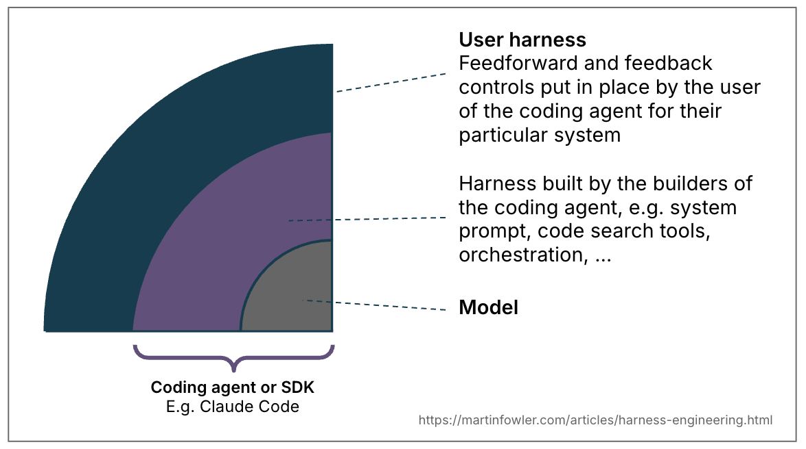

# Harness Engineering for Coding Agent Users

> **Source:** <https://martinfowler.com/articles/harness-engineering.html>
> **Author:** Birgitta Böckeler (Thoughtworks)
> **Date:** 2 April 2026
> **Tags:** generative AI, harness engineering, context engineering, cybernetics

---

## Overview

To let coding agents work with less supervision, we need ways to increase our confidence in their results. LLMs are non-deterministic, lack our context, and think in tokens. This article provides a mental model combining emerging concepts from context and harness engineering to build that trust.

The term **harness** has emerged as a shorthand for everything in an AI agent except the model itself — *Agent = Model + Harness*. In coding agents, part of the harness is built in (system prompt, code retrieval, orchestration), but coding agents also provide features for users to build an **outer harness** for their specific use case.

A well-built outer harness serves two goals:
1. **Increases the probability** that the agent gets it right the first time
2. **Provides a feedback loop** that self-corrects as many issues as possible before they reach human eyes

---

## Feedforward and Feedback

- **Guides (feedforward controls)** — Anticipate the agent's behaviour and steer it *before* it acts. Increase the probability of good results on the first attempt.
- **Sensors (feedback controls)** — Observe *after* the agent acts and help it self-correct. Particularly powerful when they produce signals optimised for LLM consumption, e.g. custom linter messages that include self-correction instructions — a positive kind of prompt injection.

Separately, you get either an agent that keeps repeating the same mistakes (feedback-only) or an agent that encodes rules but never finds out whether they worked (feedforward-only).

---

## Computational vs Inferential

There are two execution types of guides and sensors:

- **Computational** — Deterministic and fast, run by the CPU. Tests, linters, type checkers, structural analysis. Run in milliseconds to seconds; results are reliable.
- **Inferential** — Semantic analysis, AI code review, "LLM as judge". Typically run by GPU/NPU. Slower and more expensive; results are more non-deterministic.

### Examples Table

| Direction | Comp / Inf | Example implementations |
|-----------|-----------|------------------------|
| Coding conventions | feedforward | Inferential | AGENTS.md, Skills |
| Bootstrap instructions | feedforward | Both | Skill with instructions + bootstrap script |
| Code mods | feedforward | Computational | Tool with OpenRewrite recipes |
| Structural tests | feedback | Computational | Pre-commit hook running ArchUnit tests |
| Review instructions | feedback | Inferential | Skills |

### How does harness engineering relate to context engineering?

Context engineering provides the means to make guides and sensors available to the agent. Engineering a user harness for a coding agent is a specific form of context engineering.

---

## The Steering Loop

The human's job is to **steer** the agent by iterating on the harness. Whenever an issue happens multiple times, the feedforward and feedback controls should be improved to make the issue less probable or prevent it entirely.

AI can also help improve the harness: agents can write structural tests, generate draft rules from observed patterns, scaffold custom linters, or create how-to guides from codebase archaeology.

---

## Timing: Keep Quality Left

Teams who continuously integrate have always distributed tests, checks and reviews across the development timeline by cost, speed and criticality. When aspiring to continuously deliver, every commit state should ideally be deployable. Feedback sensors — including inferential ones — need to be distributed across the lifecycle accordingly.

### Feedforward and feedback in the change lifecycle

- **Before commit (fast):** LSP, architecture.md, `/how-to-test` skill, AGENTS.md, linters (`npx eslint`, semgrep), coverage, dep-cruiser, `/code-review` skill
- **Human review:** Additional feedback sensor
- **Post-integration pipeline (more expensive):** Re-runs all previous sensors + `/architecture-review` skill, `/detailed-review` skill, mutation testing

### Continuous drift and health sensors

- **Continuous drift detection in the codebase:** `/find-dead-code`, `/code-coverage-quality`, dependabot
- **Continuous runtime feedback:** Latency/error-rate/availability SLOs leading to coding agent suggestions, `/response-quality-sampling`, `/log-anomalies` AI judges

---

## Regulation Categories

The agent harness acts like a cybernetic governor, combining feedforward and feedback to regulate the codebase towards its desired state. It's useful to distinguish multiple dimensions:

### Maintainability Harness

Most examples in this article regulate internal code quality and maintainability — the easiest type, as we have a lot of pre-existing tooling.

- **Computational sensors** catch structural issues reliably: duplicate code, cyclomatic complexity, missing coverage, architectural drift, style violations. Cheap, proven, deterministic.
- **Inferential sensors** can partially address problems requiring semantic judgment — semantically duplicate code, redundant tests, brute-force fixes — but expensively and probabilistically.
- **Neither catches reliably:** Misdiagnosis, overengineering, misunderstood instructions. These higher-impact problems can sometimes be caught but not reliably enough to reduce supervision.

### Architecture Fitness Harness

Guides and sensors that define and check architecture characteristics — essentially [Fitness Functions](https://www.thoughtworks.com/en-de/radar/techniques/architectural-fitness-function).

Examples:
- Skills that feedforward performance requirements + performance tests that feed back improvements/degradations
- Skills describing coding conventions for observability (logging standards) + debugging instructions that reflect on log quality

### Behaviour Harness

The elephant in the room — how do we guide and sense if the application functionally behaves correctly?

Current approach for high-autonomy agents:
- **Feedforward:** Functional specification (short prompt to multi-file descriptions)
- **Feedback:** Check if AI-generated test suite is green, has reasonable coverage, possibly monitored with mutation testing, combined with manual testing

This puts a lot of faith in AI-generated tests — that's not good enough yet. The **approved fixtures** pattern shows promise selectively, but it's not a wholesale answer. Much work remains on good harnesses for functional behaviour.

---

## Harnessability

Not every codebase is equally amenable to harnessing:
- Strongly typed languages naturally have type-checking as a sensor
- Clearly definable module boundaries afford architectural constraint rules
- Frameworks like Spring abstract away details, implicitly increasing agent success probability

Without those properties, controls are harder to build.

### Ambient Affordances

Ned Letcher's term for properties of the agent environment that make it more harnessable: *"structural properties of the environment itself that make it legible, navigable, and tractable to agents operating within it."*

- **Greenfield** teams can bake harnessability in from day one — technology decisions and architecture choices determine governability
- **Legacy** teams face the harder problem: the harness is most needed where it is hardest to build

---

## Harness Templates

Most enterprises have common service topologies covering 80% of needs: business services exposing APIs, event processors, data dashboards. These topologies may evolve into **harness templates**: a bundle of guides and sensors leashing a coding agent to a topology's structure, conventions and tech stack.

Teams may start picking tech stacks partly based on what harnesses are already available.

### Ashby's Law of Requisite Variety

[Ashby's Law](https://en.wikipedia.org/wiki/Variety_(cybernetics)#Law_of_requisite_variety) says a regulator must have at least as much variety as the system it governs. An LLM coding agent can produce almost anything, but committing to a topology narrows that space, making a comprehensive harness more achievable. **Defining topologies is a variety-reduction move.**

Challenges mirror service templates: instantiated templates drift from upstream improvements. Harness templates face the same versioning and contribution problems, potentially worse with non-deterministic guides and sensors that are harder to test.

---

## The Role of the Human

Human developers bring implicit harness to every codebase: absorbed conventions, felt cognitive pain of complexity, social accountability, organisational alignment — awareness of team goals, tolerated technical debt, and what "good" looks like in context.

A coding agent has none of this: no social accountability, no aesthetic disgust at a 300-line function, no intuition for "we don't do it that way here," no organisational memory.

> Harnesses are an attempt to externalise and make explicit what human developer experience brings to the table, but it can only go so far. A good harness should not necessarily aim to fully eliminate human input, but to **direct it to where our input is most important.**

---

## Open Questions

- How do we keep a harness coherent as it grows, with guides and sensors in sync?
- How far can we trust agents to make sensible trade-offs when instructions and feedback signals conflict?
- If sensors never fire, is that high quality or inadequate detection?
- We need harness coverage/quality evaluation similar to code coverage and mutation testing
- Feedforward and feedback controls are scattered across delivery steps — potential for tooling that configures, syncs, and reasons about them as a system
- Building the outer harness is an **ongoing engineering practice**, not a one-time configuration

---

## Industry Examples

- **OpenAI** documented their harness: layered architecture enforced by custom linters and structural tests, recurring "garbage collection" scans for drift. *"Our most difficult challenges now center on designing environments, feedback loops, and control systems."*
- **Stripe's minions** use pre-push hooks running relevant linters, emphasise "shift feedback left", and their "blueprints" integrate feedback sensors into agent workflows
- **Mutation and structural testing** are computational feedback sensors experiencing a resurgence
- **LSPs and code intelligence** integration in coding agents as computational feedforward guides
- **Architecture drift** tackled with both computational and inferential sensors (API quality via agents + custom linters, "janitor army" for code quality)
